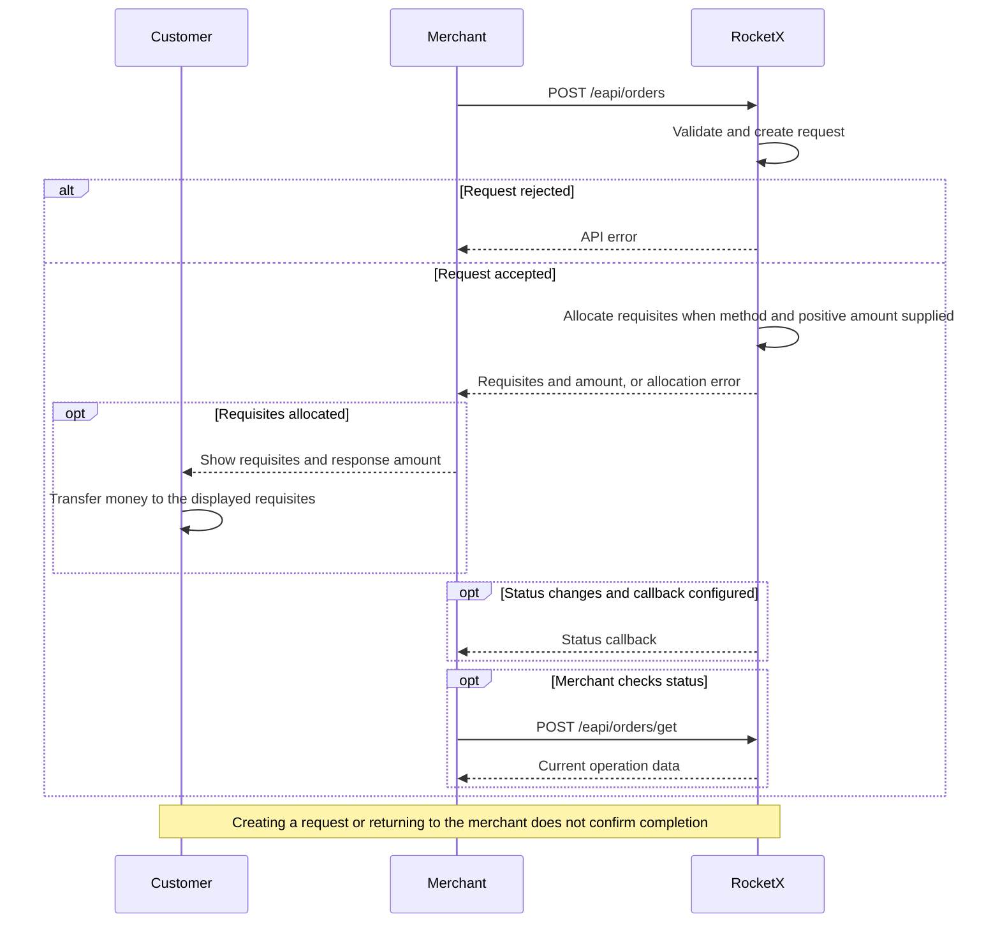

# P2C: Order / H2H

## Integration Flow



Use H2H when the partner sends all order data through the API.

1. The partner creates an order through `POST /eapi/orders`.
2. RocketX creates the order request.
3. If `payment_type` and a positive `amount` are provided, RocketX tries to
   allocate payment requisites immediately.
4. On success, the partner receives `order_id`, `form_uri`, status data, and
   payment requisites. If allocation fails, the API returns an error.
5. The partner shows the returned requisites and response `amount` to the
   customer. The customer makes the payment to those requisites.
6. The partner tracks the result through [callbacks](./callback.md) or
   [Get Order Status](./order-status.md). Creation does not confirm payment.

## HTTP Request
```http
POST /eapi/orders
Content-Type: application/json
```

The request must be signed. See [Signature](./signature.md).

## Request Body

Use the exact `payment_type` tag enabled for your merchant, currency, and
operation. Availability is configured separately for orders and withdraws.
The tags in the examples are illustrative; replace them with your enabled tags.

```json
{
  "user_cid": "client-1",
  "currency": "ARS",
  "payment_type": "ACCOUNTARS",
  "amount": 100.55,
  "cid": "order-128",
  "merchant_cid": "merchant-2",
  "description": "Order description",
  "fio": "Juan Perez",
  "fingerprint": "customer-fingerprint",
  "callback_url": "https://merchant.example/callbacks/orders",
  "cuit": "20112223334",
  "form_options": {
    "redirect_url": "https://merchant.example/orders/order-128"
  }
}
```

## Request Parameters

| Parameter | Type | Required | Description |
|---|---:|:---:|---|
| `user_cid` | string | Yes | Customer ID in the partner system. |
| `currency` | string | Yes | Use `ARS`. |
| `payment_type` | string | Yes for H2H | Payment method tag enabled for the merchant. Required to allocate requisites without using the hosted form. |
| `amount` | number | Yes | Positive fiat amount. A zero amount does not allocate requisites for H2H. |
| `cid` | string | Yes | Unique order ID in the partner system. |
| `merchant_cid` | string | No | Merchant-side identifier from the partner system. |
| `description` | string | No | Order description. |
| `fio` | string | No | Customer full name when required by the selected flow or payment method. |
| `fingerprint` | string | Yes | Customer fingerprint used to identify the same customer across accounts. |
| `callback_url` | string | No | URL where RocketX sends order status callbacks. |
| `enable_amount_increment_logic` | boolean | No | Accepted request field. Use only if this option is enabled for the partner. |
| `form_options` | object | No | Hosted form options. |
| `phone_number` | string | No | Customer phone number when required by the selected payment method. |
| `cuit` | string | Yes | Customer CUIT. Required at creation for both H2H and redirect. Send 11 digits without separators. |

### form_options

| Parameter | Type | Required | Description |
|---|---:|:---:|---|
| `redirect_url` | string | No | Destination of the return link on the hosted payment page. It does not confirm payment. |

## Successful Response

```json
{
  "status": "in_work",
  "amount": 100.55,
  "order_id": "430551eecdb8ecb842621cce",
  "requisites": {
    "account_number": "0000156009805252099382",
    "bank": "BANK",
    "fio": "Juan Perez"
  },
  "timer": 1788603300,
  "form_uri": "https://uragan.cash/external/orders/430551eecdb8ecb842621cce",
  "canceled_reason": ""
}
```

| Parameter | Type | Description |
|---|---:|---|
| `status` | string | Current order request status. |
| `amount` | number | Final amount assigned to the order. |
| `order_id` | string | RocketX order ID. Use it for status requests and callbacks reconciliation. |
| `requisites` | object, null | Payment requisites. Returned when requisites are allocated. |
| `timer` | integer, null | Countdown deadline as a Unix timestamp in seconds. `0` means no countdown; `null` means no associated order. |
| `form_uri` | string | Hosted payment page URL. |
| `canceled_reason` | string | Cancel reason code. Empty unless the order is canceled. |

## Requisites

The `requisites` object depends on the selected payment method.

| Payment method type | Requisites fields |
|---|---|
| Account number only | `account_number` |
| Argentina bank transfer (`ACCOUNTARS`) | `account_number`, `bank`, `fio` |
| Argentina QR | `qr`, `qr_data` |
| Other card/account methods | `number`, `bank`, `fio` |

These rows describe response shapes, not values to send as `payment_type`
or a list of methods enabled for your merchant.

For an Argentina bank transfer configured for other banks, `bank` is an
empty string.

## Error Responses
The same API error format applies to H2H and redirect creation. On an error,
`form_uri` is not returned. See [Errors](./errors.md) for the full response
summary.

Authentication errors return HTTP `401`.

```json
{
  "message": "Bad credentials"
}
```

Validation or business errors return HTTP `400`.

```json
{
  "errors": {
    "base": ["no_requisite"]
  }
}
```

```json
{
  "errors": {
    "payment_type": ["is invalid"]
  }
}
```

Internal errors return HTTP `500`.

```json
{
  "errors": {
    "base": ["Internal error"]
  }
}
```

## Notes

- If the customer is blocked, the response contains `banned_client`.
- If no requisites are available, the response contains `no_requisite`.
- If the amount is outside the allowed limits, the response can contain
  `AMOUNT_OUT_OF_LIMIT`.
- `cid` must be unique for the partner.

## Track an Order

[Get Order Status](./order-status.md) or receive [callbacks](./callback.md).
