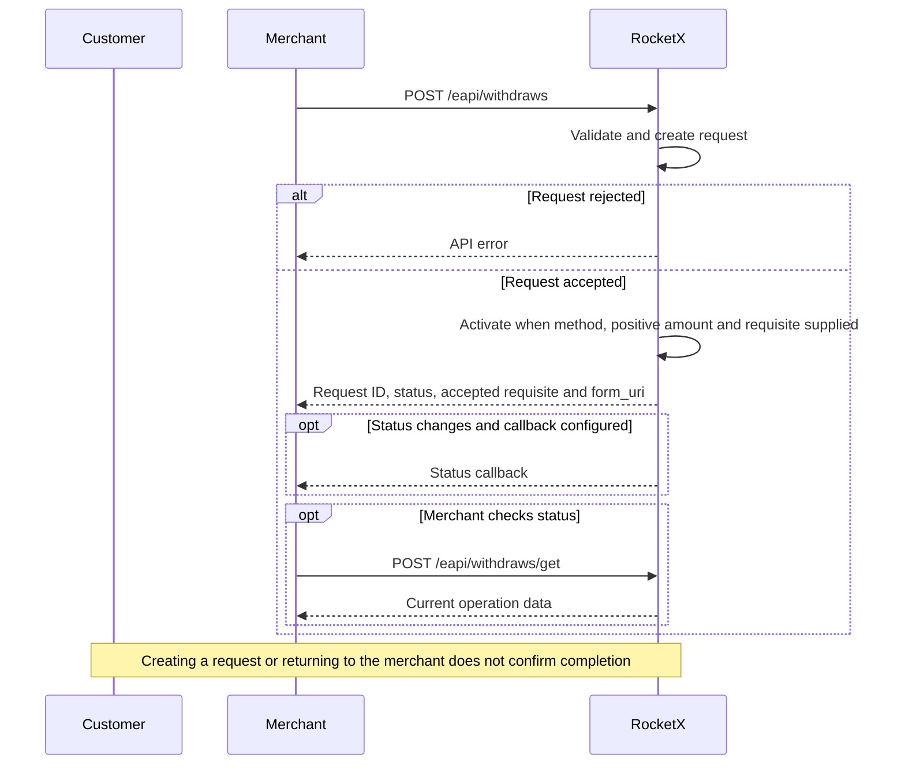
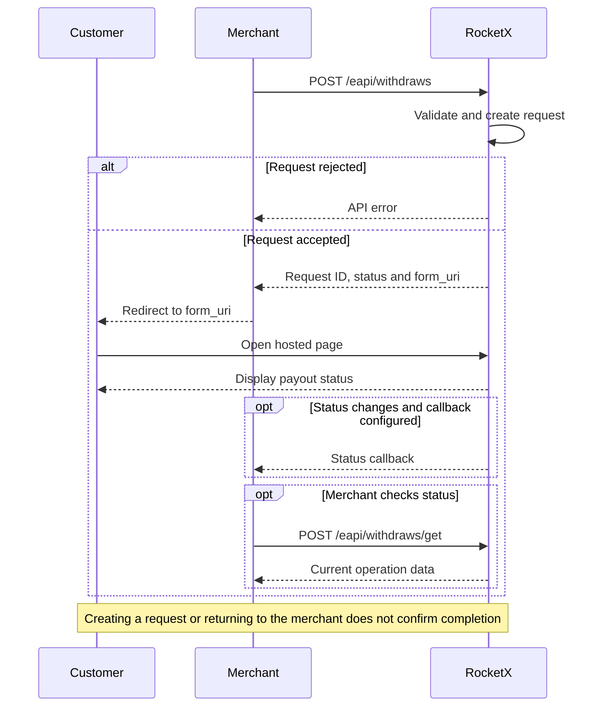

# P2C: Withdraw

Create a withdraw when the partner needs RocketX to process a payout to a
customer.

## Flow Options

### H2H



Use H2H when the partner sends the payout details through the API.

1. The partner creates a withdraw through `POST /eapi/withdraws`.
2. RocketX creates the withdraw request.
3. If `payment_type`, a positive `amount`, and `requisite` are provided, RocketX
   activates the withdraw request.
4. On success, the partner receives `withdraw_id`, `form_uri`, status data,
   and the accepted requisite data.
5. The partner tracks the result through [callbacks](./callback.md) or
   [Get Withdraw Status](./withdraw.md?id=get-withdraw-status). Creation does not mean that
   the payout has been completed.

### Redirect



For Argentina P2C, the API requires `requisite.cuit` before it returns
`form_uri`. A non-empty `requisite` also requires `payment_type` and a positive
`amount`, and must pass validation for the selected payment method. Do not
omit these details expecting the hosted page to collect them later.

1. The partner creates a withdraw through `POST /eapi/withdraws` and checks
   the response for errors.
2. On success, the partner redirects the customer to the returned `form_uri`.
3. The hosted page displays the payout status. The required payout details
   were already supplied and validated during creation.
4. The partner tracks the result through callbacks or Get Withdraw Status.

`form_uri` is the hosted payout page. `form_options.redirect_url` is the
partner return link displayed when the withdraw is `closed` or `canceled`.
Returning to the partner does not confirm a successful payout; check the API
status or callback.

## HTTP Request

```http
POST /eapi/withdraws
Content-Type: application/json
```

The request must be signed. See [Signature](./signature.md).

## Request Body

Use the exact `payment_type` tag enabled for your merchant, currency, and
operation. Availability is configured separately for orders and withdraws.
The tags in the examples are illustrative; replace them with your enabled tags.

```json
{
  "user_cid": "client-1",
  "currency": "ARS",
  "payment_type": "ACCOUNTARS",
  "amount": 100.55,
  "cid": "withdraw-128",
  "merchant_cid": "merchant-2",
  "description": "Withdraw description",
  "fingerprint": "customer-fingerprint",
  "requisite": {
    "account_number": "1234567890123456789012",
    "cuit": "20112223334"
  },
  "callback_url": "https://merchant.example/callbacks/withdraws",
  "form_options": {
    "redirect_url": "https://merchant.example/withdraws/withdraw-128"
  }
}
```

## Request Parameters

| Parameter | Type | Required | Description |
|---|---:|:---:|---|
| `user_cid` | string | Yes | Customer ID in the partner system. |
| `currency` | string | Yes | Use `ARS`. |
| `payment_type` | string | Yes | Payment method enabled for the merchant. |
| `amount` | number | Yes | Fiat amount. Must be greater than `0` when `requisite` is non-empty. |
| `cid` | string | Yes | Unique withdraw ID in the partner system. |
| `merchant_cid` | string | No | Merchant-side identifier from the partner system. |
| `description` | string | No | Withdraw description. |
| `fingerprint` | string | Yes | Customer fingerprint used to identify the same customer across accounts. |
| `requisite` | object | Yes | Customer payout requisite. Argentina P2C requires `requisite.cuit` at creation, including requests that use the hosted page. |
| `callback_url` | string | No | URL where RocketX sends withdraw status callbacks. |
| `form_options` | object | No | Hosted form options. |

### form_options

| Parameter | Type | Required | Description |
|---|---:|:---:|---|
| `redirect_url` | string | No | Destination of the return link shown for `closed` or `canceled` withdraws. |

## Requisite Parameters

The `requisite` object depends on the selected payment method.

| Payment method type | Requisite fields |
|---|---|
| Argentina bank transfer (`ACCOUNTARS`) | `account_number`, `cuit` |
| Other card/account methods | `number`, `cuit` |

### Argentina bank transfer

```json
{
  "requisite": {
    "account_number": "1234567890123456789012",
    "cuit": "20112223334"
  }
}
```

| Parameter | Type | Required | Description |
|---|---:|:---:|---|
| `account_number` | string | Yes | Account number. Send 22 digits without separators. |
| `cuit` | string | Yes | Customer CUIT. Required at creation for both H2H and redirect. Send 11 digits without separators. |

Account aliases are not supported for P2C. Send `account_number`.

## Successful Response

```json
{
  "status": "active",
  "withdraw_id": "430551eecdb8ecb842621cce",
  "requisite": {
    "account_number": "1234567890123456789012",
    "cuit": "20112223334"
  },
  "form_uri": "https://uragan.cash/external/withdraws/430551eecdb8ecb842621cce",
  "canceled_reason": ""
}
```

| Parameter | Type | Description |
|---|---:|---|
| `status` | string | Created withdraw status. |
| `withdraw_id` | string | RocketX withdraw ID. Use it for status requests and callbacks reconciliation. |
| `requisite` | object | Accepted payout requisite data. |
| `form_uri` | string | Hosted payout page URL. |
| `canceled_reason` | string | Cancel reason code. Empty unless the withdraw is canceled. |

If `payment_type`, a positive `amount`, and `requisite` are provided, the
withdraw is activated and returned with `active` status. These fields are
required at creation for this integration, including Redirect requests.

## Get Withdraw Status

Use this method to get the current withdraw status.

```http
POST /eapi/withdraws/get
Content-Type: application/json
```

The request must be signed. See [Signature](./signature.md).

Find the withdraw by RocketX `withdraw_id` or by partner `cid`.

```json
{
  "withdraw_id": "430551eecdb8ecb842621cce"
}
```

```json
{
  "cid": "withdraw-128"
}
```

The response contains the full withdraw data:

```json
{
  "withdraw_id": "430551eecdb8ecb842621cce",
  "cid": "withdraw-128",
  "status": "in_work",
  "canceled_reason": "",
  "currency": "ARS",
  "payment_type": "ACCOUNTARS",
  "requisite": {
    "account_number": "1234567890123456789012",
    "cuit": "20112223334"
  },
  "amount_in_currency": 100.55,
  "rate": 1,
  "full_amount": 100.55,
  "commission": 0,
  "amount": 100.55,
  "created_at": "2026-09-05T10:00:00.000Z",
  "updated_at": "2026-09-05T10:05:00.000Z",
  "description": "Withdraw description",
  "merchant_cid": "merchant-2",
  "user_cid": "client-1",
  "fingerprint": "customer-fingerprint",
  "callback_url": "https://merchant.example/callbacks/withdraws",
  "form_options": {
    "redirect_url": "https://merchant.example/withdraws/withdraw-128"
  }
}
```

## Error Responses

The same API error format applies to H2H and redirect creation. On an error,
`form_uri` is not returned. See [Errors](./errors.md) for the full response
summary.

Authentication errors return HTTP `401`.

```json
{
  "message": "Bad credentials"
}
```

Validation or business errors return HTTP `400`.

```json
{
  "errors": {
    "payment_type": ["is invalid"]
  }
}
```

```json
{
  "errors": {
    "requisite.account_number": ["is invalid"]
  }
}
```

Internal errors return HTTP `500`.

```json
{
  "errors": {
    "base": ["Internal error"]
  }
}
```

## Notes

- If the customer is blocked, the response contains `banned_client`.
- If `cid` has already been used by the same partner, the response contains a
  `cid` validation error.
